<p align="center">
  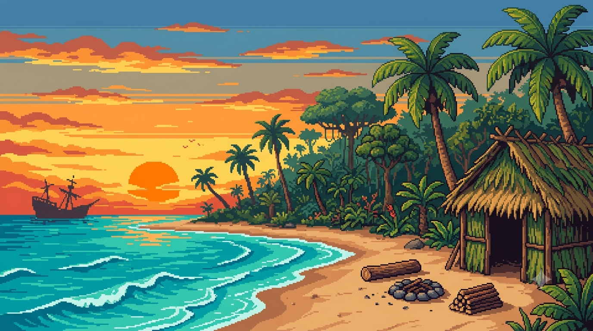
</p>

<p align="center">
  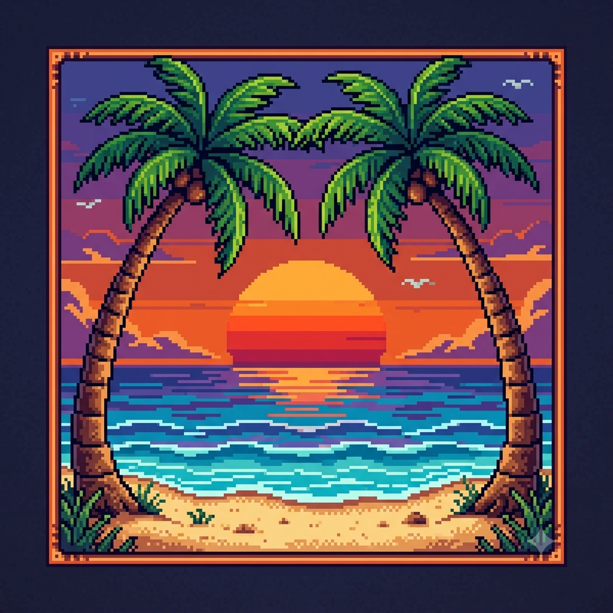
</p>

<h1 align="center">🌴 L'ISOLA — Sopravvivenza</h1>

<p align="center">
  <b>Il gioco di carte di sopravvivenza pixel art 16-bit.</b><br>
  Sei naufragato su un'isola deserta: <b>sopravvivi 21 giorni</b> e il giorno 22 arriva la nave di soccorso.<br>
  Nessun server, nessuna dipendenza: HTML + CSS + JavaScript vanilla. Funziona ovunque, anche <code>file://</code>.
</p>

<p align="center">
  <a href="https://sancioPanza88.github.io/L-Isola/" title="Gioca subito dal browser, anche dal telefono"><b>▶ GIOCA ORA (GitHub Pages)</b></a>
  &nbsp;•&nbsp;
  <a href="manual.html">📖 Manuale illustrato</a>
  &nbsp;•&nbsp;
  
</p>

---

<h2 align="center">⚓ OBIETTIVO</h2>

<p align="center">
  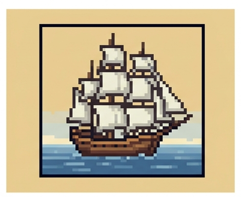
  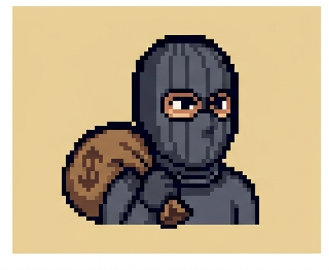
</p>

| | |
|---|---|
| ✅ **VITTORIA** — Sopravvivi **21 giorni**: il giorno 22 arriva la nave di soccorso. | 💀 **SCONFITTA** — Se i tuoi **Punti Vita (PV)** arrivano a **0**, l'isola vince su di te. |
| Parti con **20 PV** e gestisci **Cibo, Acqua, Legna ed Erbe** (max **9** per tipo). Ogni sera consumi 1 Cibo e 1 Acqua: se mancano, perdi 1 PV. | Eventi, ladri, tempeste e malattie ti attaccano; carte, strumenti e nuovi amici ti salvano. |

---

<h2 align="center">🍉 LE RISORSE</h2>

<p align="center">
  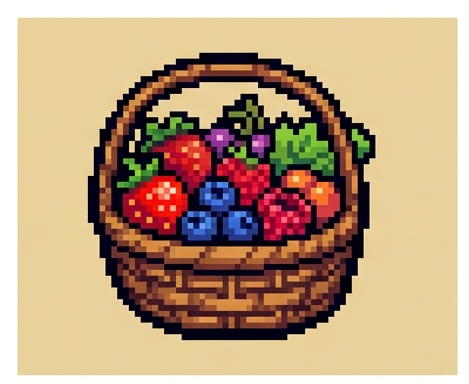
  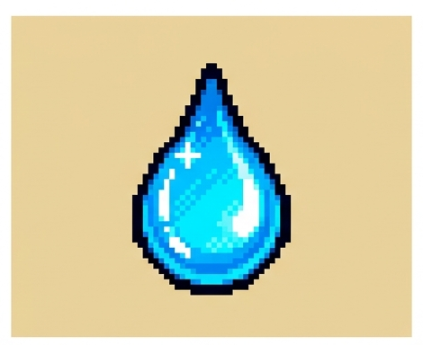
  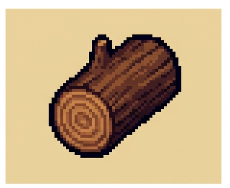
  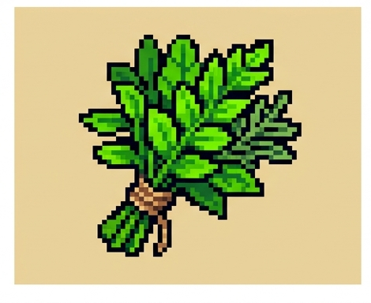
</p>

| Risorsa | Come si ottiene | A cosa serve |
|---|---|---|
| 🍗 **Cibo** | Bacche, pesca, trappole, cocco, nido di tartarughe | Si consuma **ogni sera** (1). Senza: **-1 PV** |
| 💧 **Acqua** | Fontane, pozzi, pioggia | Si consuma **ogni sera** (1). Senza: **-1 PV** |
| 🪵 **Legna** | Raccolta legna, tesoro del relitto | **Tempesta** (2 Legna), **Pentola di coccio** |
| 🌿 **Erbe** | Erbe medicinali, pane di radici | Cure **Malattia** e **Sciame di insetti** (1 a uso) |

---

<h2 align="center">☀️ LA GIORNATA PASSO-PASSO</h2>

| | |
|---|---|
| **1. EVENTO DEL GIORNO** — ogni mattina uno dei 12 eventi: pioggia, sole, tempesta, ladro... | 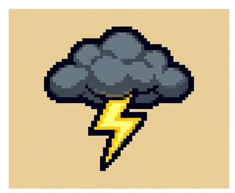 |
| **2. PESCHI LA MANO** — 5 carte (6 con lo **Zaino grande**). Giocate e scartate tornano nel mazzo quando finisce lo scarto. | 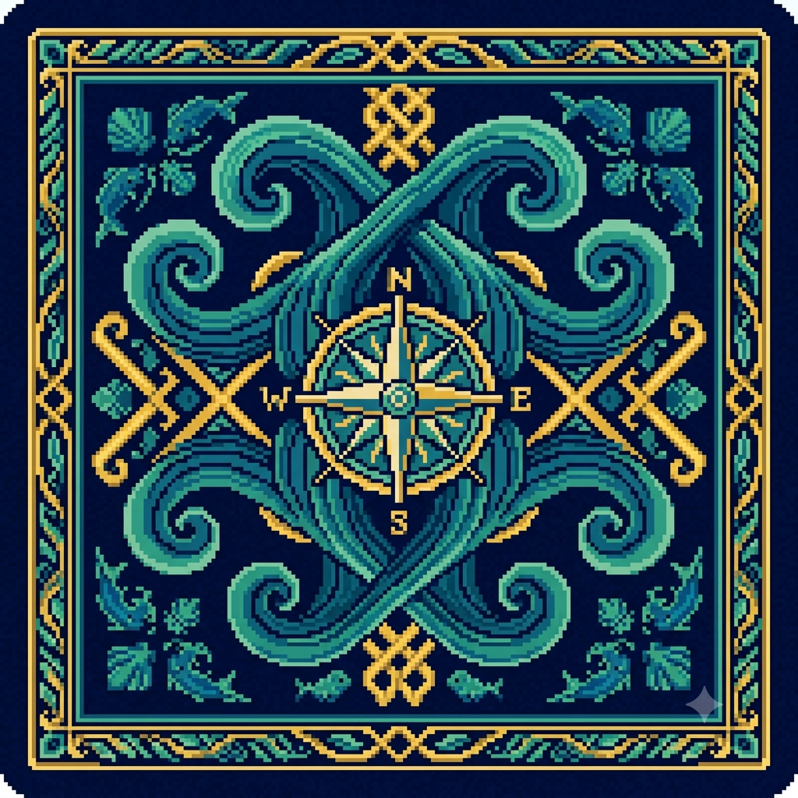 |
| **3. HAI 3 AZIONI** — giocare una carta costa 1 azione. Esplorazione e Giorno di sole ne aggiungono. | 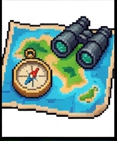 |
| **4. GIOCHI LE CARTE** — le **AZIONI** hanno effetto subito; gli **STRUMENTI** e le **PERSONE** restano attivi per sempre nell'**Accampamento**. | 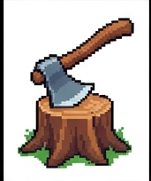 |
| **5. CONCLUDI GIORNATA** — consumi **-1 Cibo, -1 Acqua**, poi i bonus di fine giornata (Rete da pesca, Amaca, Cuciniera...). | 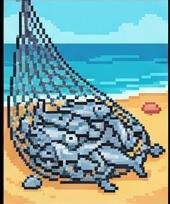 |
| **6. RIPETI** — 21 giorni. Ogni giorno la tensione sale: dopo il giorno 10 gli eventi negativi diventano più frequenti. | 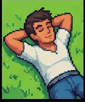 |

---

<h2 align="center">🃏 LE 30 CARTE</h2>

<p align="center">
  <em>🟢 Azioni (effetto immediato) • 🔵 Strumenti (restano attivi) • 🟠 Persone (amici per sempre)</em>
</p>

<p align="center">
  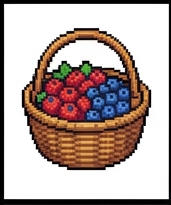
  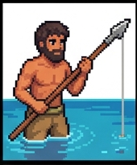
  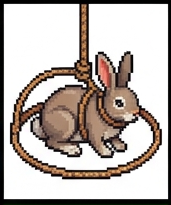
  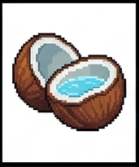
  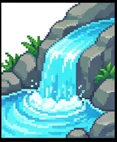
  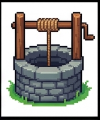
  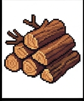
  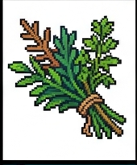
  
  
  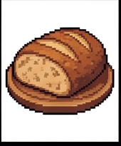
  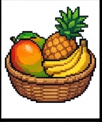

  
  
  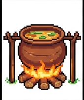
  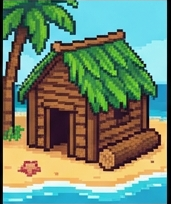
  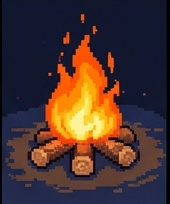
  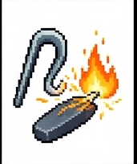
  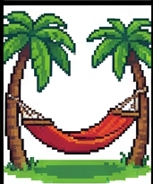
  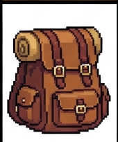

  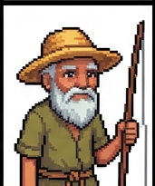
  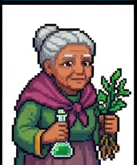
  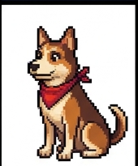
  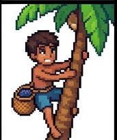
  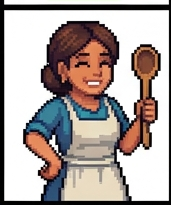

  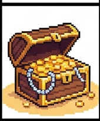
  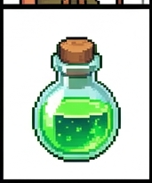
  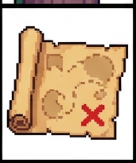
  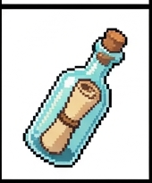
  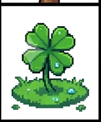
</p>

Passa sopra le carte (o tienile premute al telefono) per vedere il nome nel tooltip. La tabella completa con tutti gli effetti è qui sotto.

<details>
<summary><b>📋 Tabella completa delle 30 carte (nome · tipo · effetto)</b></summary>

| # | Nome | Tipo | Effetto |
|---|------|------|---------|
| 1 | Raccolta di bacche | AZIONE | +2 Cibo |
| 2 | Pesca con la lancia | AZIONE | +2 Cibo |
| 3 | Trappola per conigli | AZIONE | +2 Cibo |
| 4 | Cocco dell'isola | AZIONE | +1 Cibo, +1 Acqua |
| 5 | Fontana d'acqua | AZIONE | +2 Acqua |
| 6 | Scavo del pozzo | AZIONE | +2 Acqua |
| 7 | Raccolta legna | AZIONE | +2 Legna (con l'Accetta: +3) |
| 8 | Erbe medicinali | AZIONE | +2 Erbe |
| 9 | Riposo | AZIONE | +1 PV |
| 10 | Esplorazione | AZIONE | Peschi 1 carta dal mazzo |
| 11 | Pane di radici | AZIONE | +1 Cibo, +1 Erbe |
| 12 | Frutta tropicale | AZIONE | +2 Cibo |
| 13 | Accetta | STRUMENTO | Permanente: ogni azione Legna produce +1 Legna extra |
| 14 | Rete da pesca | STRUMENTO | Permanente: +1 Cibo a fine giornata |
| 15 | Pentola di coccio | STRUMENTO | Permanente: 1 Legna → +1 Cibo (1 volta al giorno, bottone dedicato) |
| 16 | Capanna | STRUMENTO | Permanente: Tempesta e Freddo non fanno perdere PV |
| 17 | Falò | STRUMENTO | Permanente: il Freddo notturno non ti danneggia |
| 18 | Accendino | STRUMENTO | Permanente: la Tempesta richiede 1 Legna invece di 2 |
| 19 | Amaca | STRUMENTO | Permanente: +1 PV a fine giornata |
| 20 | Zaino grande | STRUMENTO | Permanente: peschi 6 carte al giorno invece di 5 |
| 21 | Naufrago pescatore | PERSONA | Permanente: giorni 3, 6, 9, 12, 15, 18, 21 → +2 Cibo |
| 22 | Anziana guaritrice | PERSONA | Permanente: giorni 4, 8, 12, 16, 20 → +2 PV |
| 23 | Cane da guardia | PERSONA | Permanente: il Ladro non ruba mai |
| 24 | Ragazzo scalatore | PERSONA | Permanente: giorni pari → +1 carta in mano |
| 25 | Cuciniera | PERSONA | Permanente: a fine giornata, se hai mangiato, +1 PV extra |
| 26 | Tesoro del relitto | AZIONE | +3 Cibo, +2 Legna |
| 27 | Medicina | AZIONE | +3 PV |
| 28 | Mappa del naufragio | AZIONE | +2 azioni oggi |
| 29 | Bottiglia col messaggio | AZIONE | Domani avrai +2 carte in mano |
| 30 | Giorno fortunato | AZIONE | Peschi 2 carte e hai +1 azione oggi |

</details>

---

<h2 align="center">⛈️ I 12 EVENTI DEL GIORNO</h2>

<p align="center">
  
  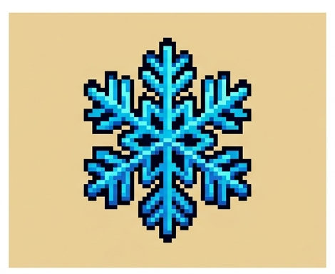
  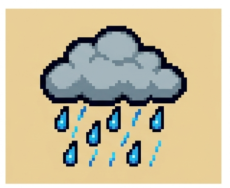
  
  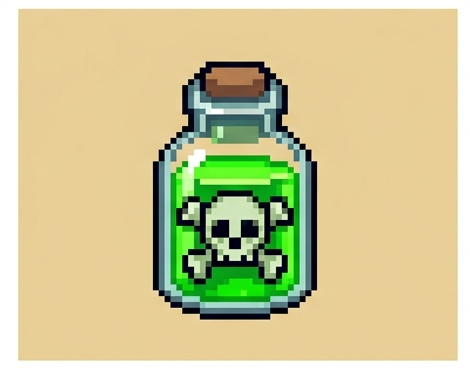
  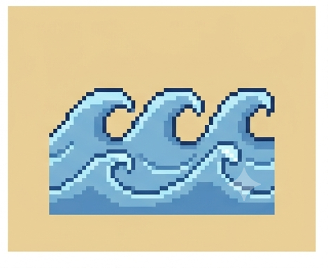
  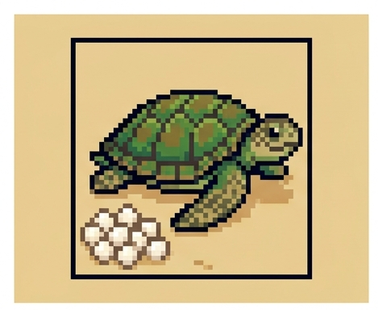
  
  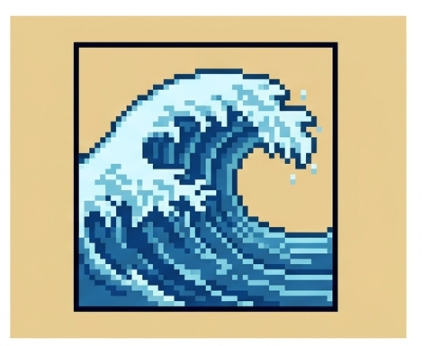
  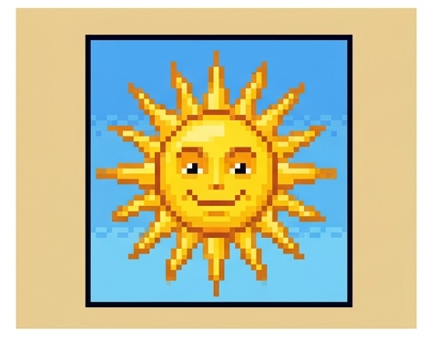
  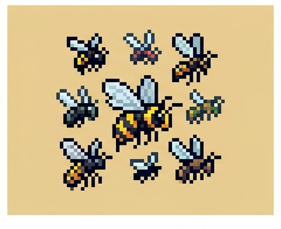
  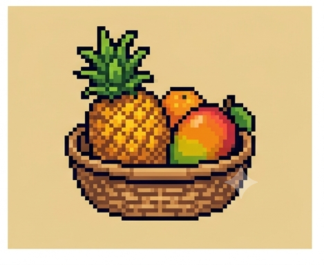
</p>

| # | Nome | Effetto |
|---|------|---------|
| 1 | Tempesta | Devi spendere 2 Legna (1 con l'Accendino), o perdi 1 PV. Con la Capanna: nessun danno |
| 2 | Freddo notturno | -1 PV (con Falò o Capanna: nessun danno) |
| 3 | Pioggia | +2 Acqua |
| 4 | Ladro | -1 Cibo (con Cane da guardia: nessun furto) |
| 5 | Malattia | -1 PV; puoi spendere 1 Erba per annullarlo |
| 6 | Mare calmo | +1 Cibo se hai la Rete da pesca attiva |
| 7 | Nido di tartarughe | +2 Cibo |
| 8 | Nave lontana | Domani peschi 1 carta in più |
| 9 | Grandi onde | -1 Cibo |
| 10 | Giorno di sole | +1 azione oggi |
| 11 | Sciame di insetti | -1 PV; puoi spendere 1 Erba per allontanarlo |
| 12 | Frutta di stagione | +1 Cibo, +1 Acqua |

Lo stesso evento non si ripete due giorni di fila, niente più di 2 giorni negativi consecutivi, e dopo il giorno 10 l'isola si fa più cattiva.

---

<h2 align="center">✨ COSE BELLE DEL GIOCO</h2>

| | |
|---|---|
| 💾 **Salvataggio automatico** | Chiudi e riprendi con "Continua": tutto in `localStorage` |
| 🎓 **Tutorial guidato** | Livello di 2 giorni con fumetti ancorati alla interfaccia |
| 📖 **Manuale illustrato animato** | <a href="manual.html"><code>manual.html</code></a> con tutte le carte e gli eventi |
| 🔊 **Audio generato al volo** | Musica ambient rilassante + effetti: WebAudio puro, zero file |
| 🏆 **Punteggi e Top 5** | Ogni partita assegna 3 obiettivi segreti; a fine corsa punteggio e classifica |
| 📱 **Mobile-friendly** | Si gioca dal telefono: carte grandi, barra dei comandi fissa in basso |
| 🛠️ **Debug automatico** | Apri `index.html?test` e una verifica simula intere giornate |

---

<h2 align="center">🗺️ COSA TROVI NEL REPO</h2>

```
L-Isola/
├── index.html      la pagina del gioco
├── style.css       tema pixel art 16-bit (texture_ui.png usata come sprite)
├── game.js         dati (30 carte + 12 eventi) e tutta la logica + tutorial
├── audio.js        motore audio WebAudio (nessun file esterno)
├── manual.html     manuale illustrato e animato del gioco
├── manual.css      stile del manuale
├── PROMPTS.md      prompt per rigenerare/estendere la grafica con Gemini
├── README.md       questo file
└── art/            50 PNG pixel art (carte, eventi, icone, logo, retro, sfondi)
```

## ✨ Tecnologia

- **Zero dipendenze**: niente CDN, niente Google Fonts (solo monospace), niente librerie.
- **Zero file binari richiesti**: `art/` PNG + colori inline. Se un'immagine manca appare il segnaposto con emoji, il gioco non si rompe mai.
- `image-rendering: pixelated` ovunque; la texture UI è un foglio 2x2 (legno scuro / chiaro / pergamena / pietra) via `background-position`.
- Funziona **anche con `file://`** (doppio click): nessun fetch, tutto inline.


---

<p align="center">
  
  <br>
  <b>L'ISOLA</b> — fatto con ❤️, palette tropicale e un tocco di pixel art.<br>
  <small>Sopravvivi. Racconta. Riprova.</small>
</p>
